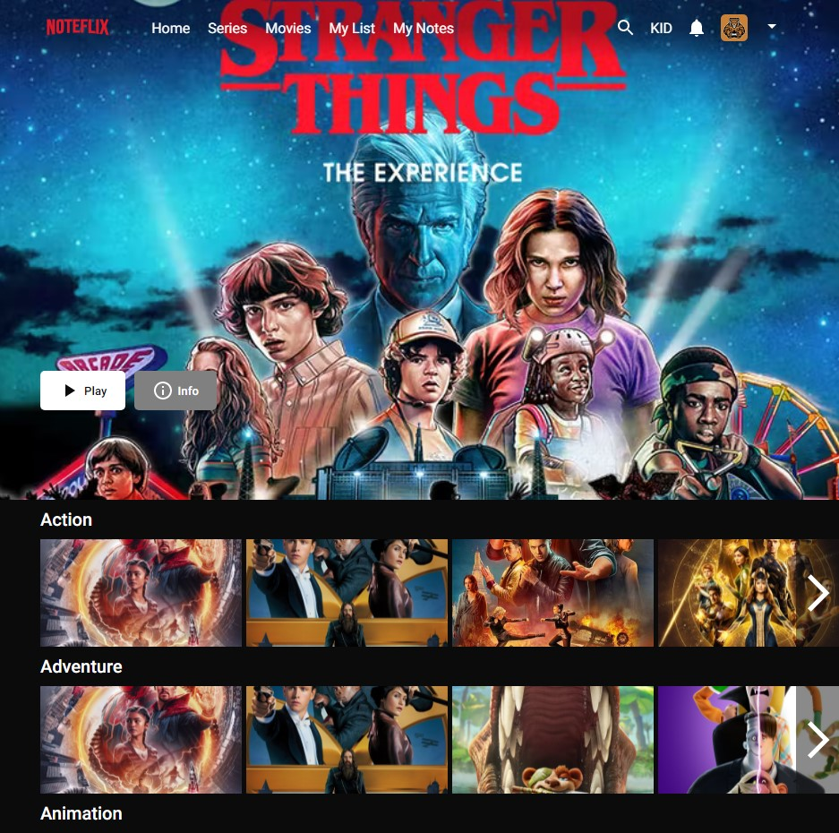

# General Information About App

This is a Noteflix App that allows to take notes about movies and series.

I used the basic [Netflix][https://www.netflix.com/] webpage style and change that with mine.

I worked with [themoviedb][https://api.themoviedb.org/3] API to get the data.

## Must Haves Features:

> these are necessary for basic usability

- [ ]Users can see movies by category name
- [ ]Users can watch the trailer or fragment
- [ ]Users can see the information about each movie
- [ ]Users can add notes about movies
- [ ]Users can delete and update the note.
- [ ]Users can see their notes in the favorites part
- [ ]Add a search button

> These are nice to have features:

- [ ]Using the server to save data.
- [ ]User can like the movies and add them to the like movies

## Available Scripts

In the project directory, you can run:

### `npm start`

Runs the app in the development mode.\
Open [http://localhost:3000](http://localhost:3000) to view it in your browser.

The page will reload when you make changes.\
You may also see any lint errors in the console.

# Project layout design:

Here is the first page of application

